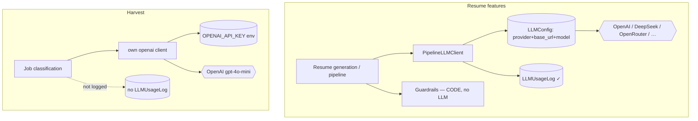

# LLM Services Map — who calls which API

A reference for *every* place the app talks to an LLM: which service, which model, which
provider, and whether it's logged. Live per-service numbers are on `/core/llm/`
("Usage by Service & Model").

## 1. Resume generation & pipeline ✅ (central, configurable, logged)
- **Client:** `apps/resumes/pipeline/llm_client.py` (`PipelineLLMClient`) + legacy `apps/resumes/engine.py`.
- **Config:** the `/core/llm/` settings (`LLMConfig`) — provider, base_url, **active_model** (generation),
  **validation_model** (cheap, reserved for the LLM audit pass), temperature, max tokens, monthly cap.
- **Provider:** whatever `LLMConfig.provider` / `base_url` points at — OpenAI, **DeepSeek**, OpenRouter, Together, custom.
- **Logged:** yes → `LLMUsageLog` (request_type + model + tokens + cost).
- **request_types you'll see:** `pipeline_v3_generate` (main single-call generation),
  `pipeline_summary` / `pipeline_skills` / `pipeline_experience*` (older multi-call paths),
  `master_resume_generation`, `pipeline_generic`.
- **Guardrails** (`pipeline/guardrails.py`): pure **code**, no LLM call — runs after generation.

## 2. Harvest job classification ⚠️ (separate key, NOT in central config, NOT logged)
- **Code:** `apps/harvest/llm_classifier.py`.
- **Client:** its own `openai.OpenAI(api_key=…)` where the key = `OPENAI_API_KEY` **env var**
  (not the encrypted key in `LLMConfig`).
- **Model:** hardcoded default `gpt-4o-mini`. **Provider:** OpenAI default (ignores `base_url`).
- **Logged:** no — these calls do **not** appear in `LLMUsageLog` or the usage breakdown.
- **Implication:** switching `/core/llm/` to DeepSeek does **not** change harvest classification —
  it still calls OpenAI with the env key. And you can't see its cost on the dashboard.

## Flow

## Recommended improvement
**Unify harvest classification onto `LLMConfig`** so:
1. one place controls the provider/model (switch everything to DeepSeek at once),
2. its cost shows up in the usage breakdown, and
3. there's a single encrypted key instead of an env var.

Implementation sketch (a `/modify`): have `llm_classifier.py` read `LLMConfig` (key via
`decrypt_value`, `base_url` via `effective_base_url()`, model via `validation_model` or a new
`classification_model`) and log to `LLMUsageLog` with `request_type="harvest_classification"`.
Keep the env-var fallback for local/offline ops.
